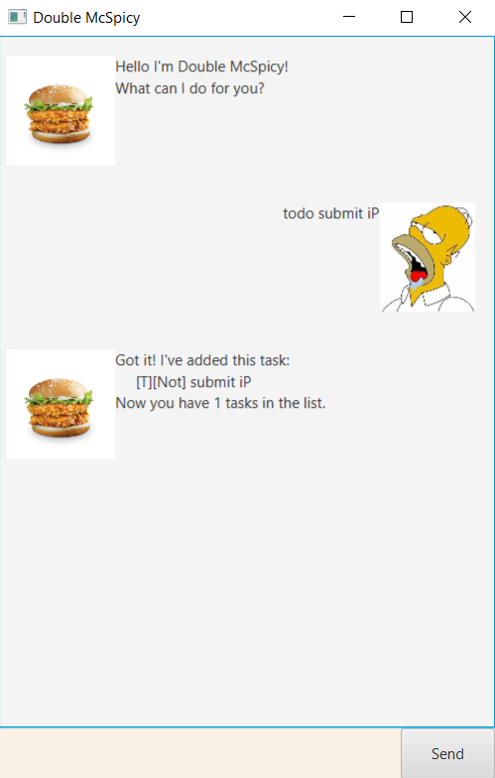
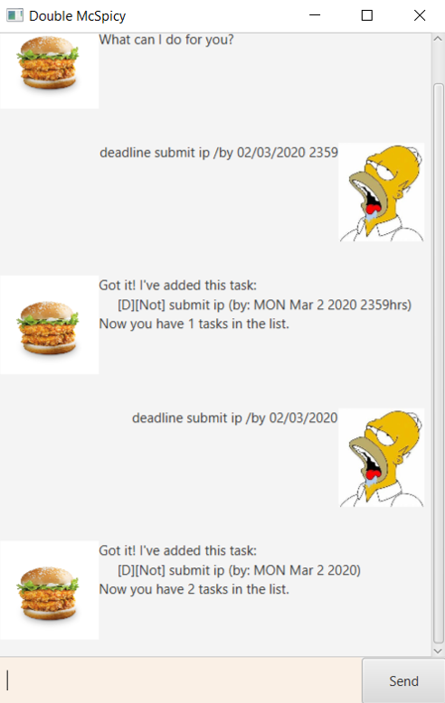
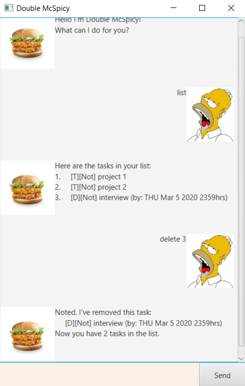

# Double McSpicy User Guide  
Double McSpicy is an easy to use bot which helps you keep track of your tasks, or when you just need a friend.
## Features 

### Add tasks 
- Adds a ToDo, Deadline, or Event task to the list of tasks.
### Delete tasks 
- Deletes a task from the list of tasks based on the index of the tasks.
### Find tasks 
- Finds task(s) which contains the desired keyword in the list of tasks.
### Mark tasks as done 
- Marks a tasks from the list of tasks as done, based on the position.
### Mass delete tasks  
- Delete tasks which contains the desired keyword from the list of tasks.
### Mass mark done tasks 
- Mark all tasks containing the desired keyword as done.
### Generate list of tasks 
- Generate the current list of tasks with their description and whether they are done or not
### Save list of tasks for future use 
- Close the app and saves the current list of tasks so that when Double McSpicy is opened in future, the list of tasks is still accessible.

## Usage

### `todo` - Adds a ToDo task to the list of tasks
Adds a ToDo task to the list of task

Format is `todo [description]`

Example of usage: 

`todo submit iP`

Expected outcome:

### `event` - Adds an Event task to the list of tasks
Adds an Event task to the list of tasks, with information about the event. The information
about the event can be the time, date, or place that the event is happening or even a combination of the above, it need
not follow a format.
The important thing about the usage is the `/at` after the description.

Format is `Event [description] /at [information]`

Example of usage: 

`event ip celebration /at tuesday 2359`

`event buffet /at raffles place tuesday 05/08/1997 7pm`

Expected outcome:

### `deadline` - Adds a Deadline task to the list of tasks
Adds a Deadline task to the list of tasks, with the date and/or time of the deadline. 

The important things about the usage is the `/by` after the description and to follow the format of the date and time
below.

Format is `Deadline [description] /by [date and/or time]`, the date must be in DD/MM/YYYY format or YYYY-MM-DD format
and the time must be in HHMM format.

Example of usage: 

`deadline submit ip /by 02/03/2020 2359`

`deadline submit ip /by 02/03/2020`

Expected outcome:

### `delete` - Deletes a task from the list
Deletes a task from the list based on its numerical position in the list 
The important things about the usage is number given must fall within the range of number of tasks on the list.

Format is `delete [position]`

Example of usage: 

`delete 3`

Expected outcome:

## Acknowledgements
Credits to Jeffry Lum for the tutorial and code for gradle, fxml, and javafx files -  [iP Tutorials](https://github.com/nus-cs2103-AY1920S2/duke/blob/master/tutorials/javaFxTutorialPart4.md)

Acknowledgements for images used:
[Double McSpicy](https://www.mcdonalds.com.sg/food-menu/double-mcspicy/) is from McDonalds Singapore, [Homer Drooling](https://www.pinterest.com/pin/488218415832350967/) is from Pinterest